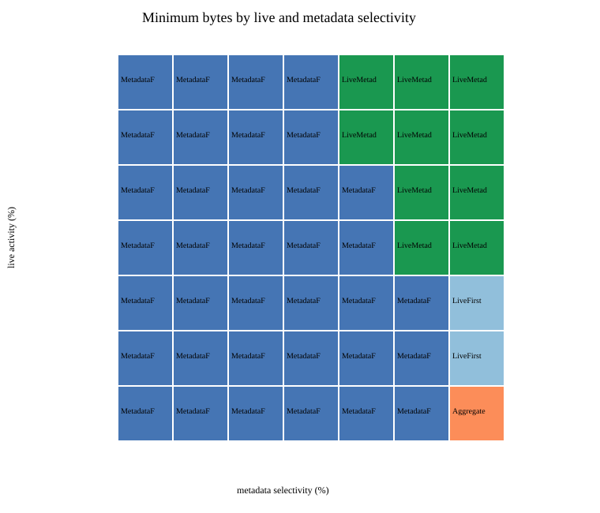

# Federated-Janus

Federated-Janus is an experimental execution layer for **Janus-QL**. It takes one hybrid query over live RDF streams and historical RDF data, decomposes it into source-specific subplans, and evaluates alternative physical execution strategies.

The current research focus is **data movement**: when should aggregation, filtering, joins, and source selection happen at the source/edge rather than at the coordinator?

## Architecture

```text
                     one Janus-QL query
                              │
                              ▼
                       JanusQLParser
                              │
                              ▼
                          Janus AST
                              │
                              ▼
                 Federated-Janus coordinator
                              │
                   logical decomposition
             ┌────────────────┼────────────────┐
             ▼                ▼                ▼
          branch 1         branch 2         branch N
             │                │                │
             └────────────────┼────────────────┘
                              ▼
                    physical execution plan
                              │
             ┌────────────────┼────────────────┐
             ▼                ▼                ▼
         live source     history source    metadata source
                              │
                              ▼
                       combined RStream
```

The sources are independently addressable abstractions. They currently execute in-process; this is **not yet a networked edge deployment**.

## What is implemented

- one parsed Janus-QL query decomposed by the coordinator
- independently addressable live and historical sensor sources
- source-level aggregation pushdown and live-first pruning
- continuous live execution at 4 Hz with a 60 s range and 30 s step
- static RDF metadata through standard SPARQL `GRAPH`
- explicit manual plans for join ordering, semijoins, and operator placement
- per-plan and per-operator transfer accounting
- semantic-equivalence checks across alternative physical plans
- current Janus-QL query form using direct live/historical `WINDOW` blocks and top-level aggregation (no deprecated baseline clauses)

There is intentionally **no automatic optimizer yet**. The current experiments establish when different manually selected plans reduce transferred bytes.

## Example query

The repository contains three query fixtures:

- [`queries/anomaly.janusql`](queries/anomaly.janusql) — shared live/history anomaly query
- [`queries/federated_anomaly_3.janusql`](queries/federated_anomaly_3.janusql) — one federated query with multiple source-pair branches
- [`queries/federated_anomaly_metadata.janusql`](queries/federated_anomaly_metadata.janusql) — live + history + metadata planning workload

The basic computation compares a current live value with a historical average:

```text
live value ───────────────┐
                          ├─ join/filter ─► anomaly result
historical source ─ AVG ──┘
```

The metadata workload adds an eligibility predicate before historical access, which creates meaningful alternative join orders and semijoin plans.

## Current evidence

Source pruning follows runtime live activity:


The planning experiment shows different byte-minimal plans in different live/metadata selectivity regions:



Detailed methodology, benchmark configurations, and earlier experiments are documented separately.

## Documentation

- [Architecture and execution model](docs/ARCHITECTURE.md)
- [Experiments and benchmark methodology](docs/EXPERIMENTS.md)
- [Research roadmap](docs/ROADMAP.md)

## Running

Federated-Janus currently expects the Janus repository as a sibling directory:

```text
parent/
├── janus/
└── federated-janus/
```

Run the test suite:

```sh
cargo test
```

Run a small explicit-plan benchmark:

```sh
cargo run --release --bin federated_benchmark -- \
  --query queries/anomaly.janusql \
  --strategy bind-join \
  --live-sensor-counts 100 \
  --repetitions 1 \
  --warmups 0
```

Run the real-time continuous smoke benchmark:

```sh
cargo run --release --bin continuous_realtime_benchmark
```

Run the query-planning transfer study:

```sh
cargo run --release --bin query_planning_bytes_benchmark -- --depth-sensitivity
```

Generated benchmark artifacts are local development output and are ignored by Git.

## Scope

Federated-Janus currently targets a deliberately narrow research subset rather than arbitrary SPARQL federation. Automatic cost-based plan selection, remote HTTP execution, source discovery, ODRL/UMA policy enforcement, and adaptive replanning remain future work.
