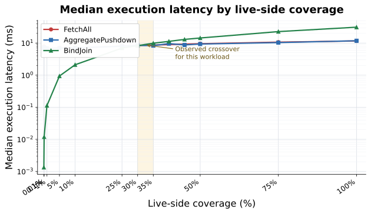
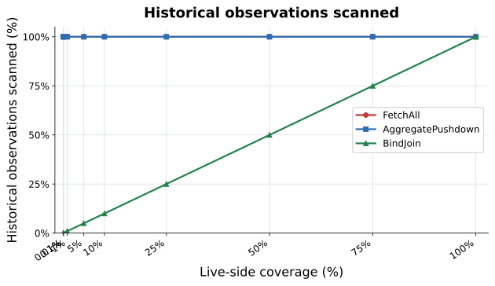

# Federated-Janus

Federated query planning, join optimization, and distributed execution for Janus-QL over historical RDF data and live RDF streams.

Janus provides unified continuous querying over historical RDF data and live RDF streams. Federated-Janus is a narrow experimental framework for measuring how equivalent hybrid queries behave under different physical plans when their logical sources are distinct. The present goal is not automatic optimization: plans are explicit and manually selected.

The project studies operator placement, join strategies, aggregation pushdown, transferred-data reduction, multi-source execution, and query-plan trade-offs. Policy-constrained execution is a future direction, not current functionality.

## Current use case

The fixed anomaly workload identifies current readings above a per-sensor historical baseline:

```text
live observations             historical observations
?sensor ?current              ?sensor ?historical
       \                        /
        \--- join ?sensor -----/
                 |
       AVG(?historical) per sensor
                 |
  FILTER(?current > 1.3 * average)
```

All three physical plans preserve this logical result.

### FetchAll

```text
Live source ---------> coordinator
Historical source ---> coordinator -> aggregate + join + filter
```

The coordinator receives the complete relevant historical window and aggregates it.

### AggregatePushdown

```text
Historical source: full scan -> AVG per sensor --\
                                              coordinator -> join + filter
Live source -----------------------------------/
```

The historical source aggregates all sensors and transfers only baselines.

### BindJoin

```text
Live source -> distinct sensor IDs -> historical source index
                                      |
                               AVG selected sensors
                                      |
                                coordinator -> join + filter
```

The historical source accesses only sensor partitions referenced by the live window.

## Preliminary experimental results

These are **preliminary experimental results**, not publication-final claims. The benchmark uses a compact internal `SensorId -> Vec<(timestamp, value)>` representation to avoid RDF-string allocation dominating plan costs. It preserves the fixed workload semantics but is not a replacement for Janus RDF storage.

The 10M-row diagnostic used one deterministic shared dataset:

```text
Historical sensors:       100,000
Observations per sensor:  100
Historical observations: 10,000,000
Warmups / measurements:   1 / 3
```

Tested live cardinalities: 10, 100, 1,000, 5,000, 10,000, 25,000, 50,000, 75,000, and 100,000. Every configuration verified equal canonical result hashes across plans.

| Live sensors | Live fraction | FetchAll median ms | AggregatePushdown median ms | BindJoin median ms |
|---:|---:|---:|---:|---:|
| 10 | 0.01% | 7.856 | 7.271 | 0.001 |
| 100 | 0.1% | 7.555 | 6.902 | 0.012 |
| 1,000 | 1% | 6.736 | 6.890 | 0.113 |
| 5,000 | 5% | 7.086 | 6.917 | 0.941 |
| 10,000 | 10% | 6.954 | 7.139 | 2.109 |
| 25,000 | 25% | 8.137 | 7.943 | 6.983 |
| 50,000 | 50% | 9.556 | 9.329 | 14.410 |
| 75,000 | 75% | 10.694 | 10.362 | 22.798 |
| 100,000 | 100% | 11.661 | 11.812 | 31.294 |

A refinement found BindJoin faster at 30% coverage (8.321 ms vs 8.452 ms) and AggregatePushdown faster at 35% (8.329 ms vs 9.909 ms). The observed crossover therefore lies between approximately 30% and 35% live-side coverage. This threshold must not be generalized to other workloads, distributions, storage engines, or network settings. FetchAll transfers roughly 240 MB here and is primarily a correctness/reference baseline.

## Diagnostic figures






README-facing copies live under `docs/figures/`; raw diagnostic artifacts remain under `results-full-diagnostic/`.

## Preliminary observations

The following observations are limited to the measured two-source workload:

- FetchAll results in substantially greater data movement than the pushed-down alternatives.
- BindJoin reduces historical processing when the live side is selective.
- AggregatePushdown has a relatively stable historical-processing cost because it processes the full historical population.
- BindJoin cost increases with the number of live bindings.
- Different physical plans become preferable under different workload characteristics.

These findings motivate further investigation of explicit physical execution strategies. They do not establish a general threshold or claim an automatic optimizer; automatic planning is optional future work.

## Next use case: three-source anomaly detection

The next experimental design adds a logically independent metadata source to the current query:

```text
Source A: live observations       ?sensor ex:value ?currentValue
Source B: historical observations ?sensor ex:value ?historicalValue
Source C: sensor metadata         ?sensor ex:locatedIn ?location
                                  ?sensor ex:sensorType ?type
```

The query detects live measurements above their historical average only when a metadata condition holds, for example `?sensor ex:locatedIn ex:RoomA`.

```text
Live ?sensor ?current ----\
                           join ---- filter current > historical baseline
Metadata RoomA ----------/  |
                              AVG historical values per sensor
                                      |
                               Historical ?sensor ?historical
```

This is a design only: no metadata source, new query lowering, or additional runtime plan is implemented yet.

### Candidate three-source physical plans

| Plan | Manual execution idea |
|---|---|
| A — Fetch everything | Materialize live, historical, and metadata sources centrally; aggregate and join at the coordinator. |
| B — Historical aggregate pushdown | Compute historical `AVG` remotely, then join live, metadata, and historical baselines centrally. |
| C — Live to historical bind join | Use live sensor IDs to restrict historical aggregation, then join metadata at the coordinator. |
| D — Metadata-first restriction | Evaluate the metadata predicate first, restrict live and historical work to matching sensors, then aggregate and join. |
| E — Live plus metadata semijoin | Intersect live sensor IDs with filtered metadata before the bound historical lookup, then perform the final join. |

The next experiment should ask whether metadata selectivity changes plan preference; whether metadata-first or live-first restriction is better; how much historical work the intersection avoids; and how join order changes latency, transfer, and intermediate-result size. No automatic join-order optimizer is planned at this stage.

## Future physical-plan families

The following are research candidates, not implemented strategies: FilterPushdown, ProjectionPushdown, SemiJoin, Multi-stage BindJoin, Metadata-first restriction, Live-first restriction, Historical-first execution, remote join execution, partial aggregation, hierarchical aggregation, cached historical aggregates, and reuse of historical intermediate results across continuous evaluations. FetchAll, AggregatePushdown, and BindJoin are the only currently implemented plans.

## Multi-source direction

Later experiments should grow beyond one live and one historical source toward `1 live + 2 historical`, `2 live + 1 historical`, `2 live + 2 historical`, `1 live + 1 historical + 1 metadata`, and multiple historical archives. Additional sources increase possible join orders, intermediate-result sizes, communication cost, and operator-placement choices. These scenarios are future experiments, not current implementation commitments.

## Policy direction

Future work may introduce source-specific policy constraints using technologies such as ODRL and UMA. Policies could constrain whether raw observations leave a source, whether aggregation executes remotely, whether intermediate bindings transfer, whether results are cached, and which requester may access a source. This would frame the problem as finding useful physical execution plans subject to source-specific policy constraints. Policies are intentionally separate from the current resource-optimization experiments and are not implemented.

## Research roadmap

```text
Phase 1 — Two-source physical plans
✓ FetchAll
✓ AggregatePushdown
✓ BindJoin
✓ preliminary scale experiment

Phase 2 — Three-source joins
○ metadata source
○ join ordering
○ semijoins
○ multi-stage bind joins

Phase 3 — Larger federation
○ multiple historical sources
○ multiple live streams
○ operator placement

Phase 4 — Governance
○ ODRL
○ UMA
○ policy-constrained plans

Phase 5 — Optional future optimization
○ automatic strategy selection
○ cost-based planning
```

## Running

Run one explicit plan:

```sh
cargo run --bin federated_janus -- --strategy bind-join --live-sensors 100 --csv experiments/smoke.csv
```

Run the full diagnostic defaults:

```sh
cargo run --release --bin federated_benchmark -- --output-dir results
```

The runner records measured repetitions only, verifies result hashes, and writes CSVs and SVG diagnostics. It has no `--strategy auto` and no planner.

## Janus integration boundary

Janus exports its parser/AST, historical storage, historical executor, Oxigraph adapter, live processor, and RDF event model. Its historical indexes are timestamp-oriented and do not expose subject-indexed bound lookup. Federated-Janus therefore leaves Janus unchanged and uses a compact benchmark-specific index only for selective-access experiments.
