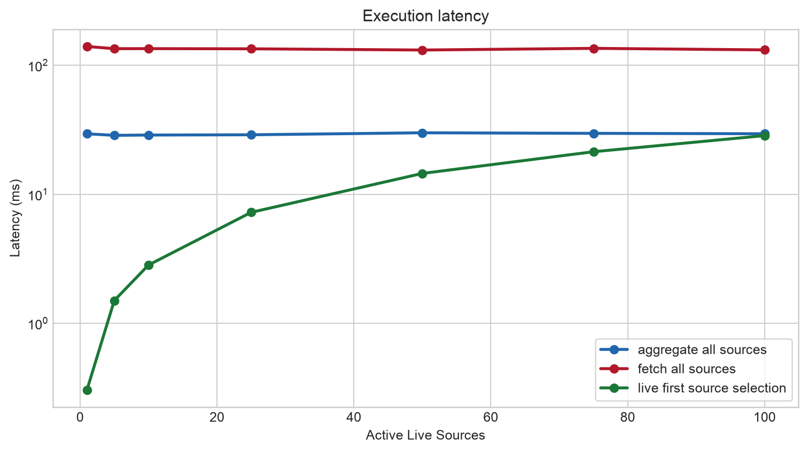
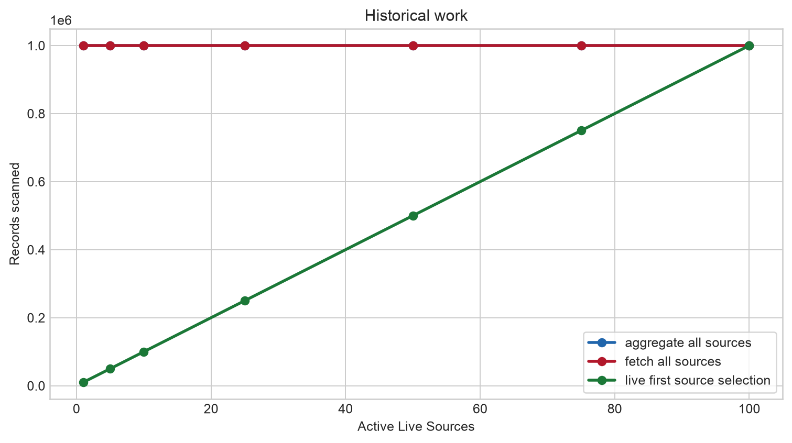
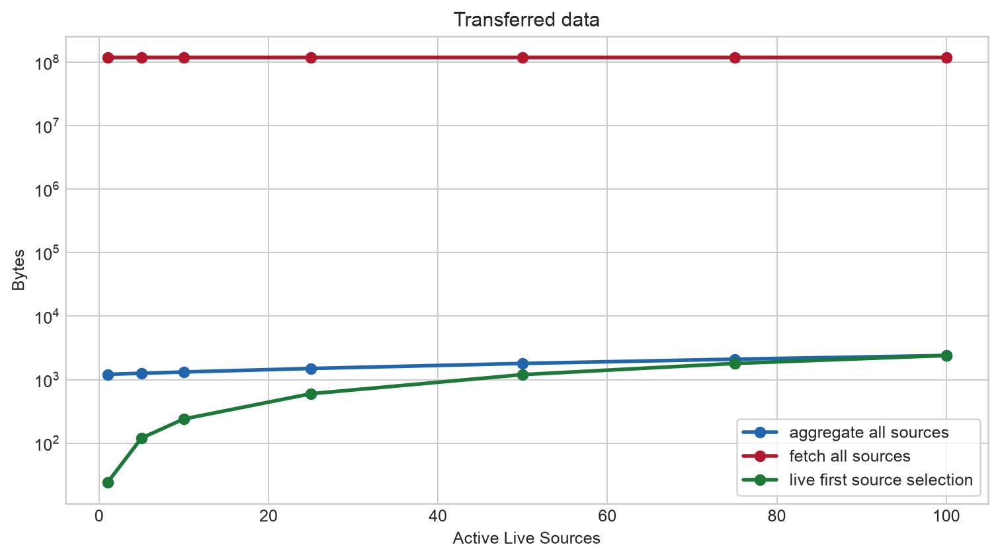
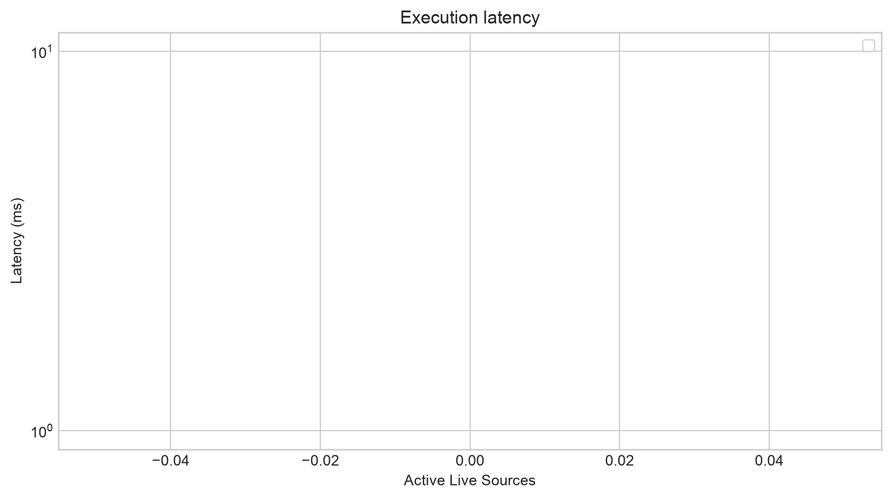
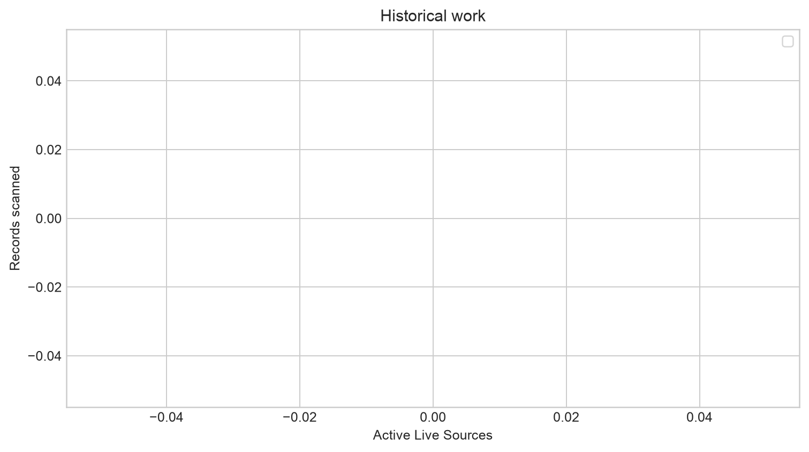
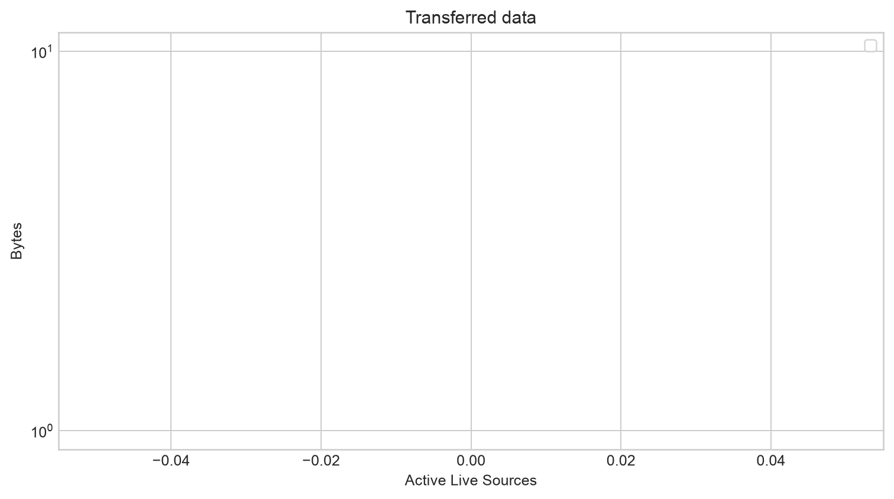

# Federated-Janus

Benchmark outputs are generated locally under `results*` directories and are intentionally not tracked. README-facing figures are kept under `docs/figures/` so the repository stays small and the documentation remains self-contained.

## Continuous real-time federation experiment

Previous experiments are deterministic single evaluations over synthetic window
state.  `continuous_realtime_benchmark` is separate: it publishes actual RDF
observations into independently addressable in-process live sources at 4 Hz,
maintains the parsed Janus-QL `RANGE 60 STEP 30` live windows, and evaluates one
registered federated query repeatedly.  It is not remote or network execution.

Run the five-pair wall-clock smoke experiment (about two minutes):

```sh
cargo run --release --bin continuous_realtime_benchmark
```

It writes local artifacts to `results-continuous-realtime/`. All `results*`
directories are ignored by Git and are not published in the repository.  `--source-pairs 10 --active-schedule 2,5,10`
demonstrates dynamic source activity.  The schedule controls publishers only;
`LiveFirstSourceSelection` discovers active branches from the live windows.

Federated query planning, join optimization, and distributed execution for Janus-QL over historical RDF data and live RDF streams.

## Query planning and data-transfer trade-offs

Previous experiments establish aggregation pushdown, live-source pruning, and
repeated continuous execution. The `query_planning_bytes_benchmark` adds one
static RDF metadata input to the same logical Janus-QL query and studies
operator ordering, join strategy, and placement by transferred bytes. Metadata
uses the standards-compatible named graph
`<https://example.org/metadata>` and the triple
`?sensor ex:locatedIn ex:RoomA`; no Janus grammar extension is used.

The benchmark has 100 independent live/history source pairs plus that metadata
source. It uses deterministic logical replay at 4 Hz, `RANGE 60 STEP 30`, and
the Janus half-open historical interval `[T - 30d, T)`. Live activity and
metadata eligibility use independent deterministic assignments. The five
equivalent, manually selected plans are `CentralFetchAll`, `AggregateAll`,
`LiveFirst`, `MetadataFirst`, and `LiveMetadataSemiJoin`. They are experiment
inputs, not an optimizer and are never automatically selected.

```sh
cargo run --release --bin query_planning_bytes_benchmark -- --depth-sensitivity
```

This writes local artifacts under `results-query-planning-bytes/`, including
measurements, operator-level metrics, a plan-dominance matrix, query metadata,
and plots. These generated artifacts are intentionally ignored by Git. Bytes are a
consistent logical wire representation: live RDF row 80 B, metadata RDF triple
72 B, aggregate tuple 48 B, sensor-key binding 40 B, and raw historical RDF
row 80 B. Local source processing is excluded. The dominance map is evidence
for a possible future cost model; it does not implement one.


Janus provides unified continuous querying over historical RDF data and live RDF streams. Federated-Janus is a narrow experimental framework for measuring how equivalent hybrid queries behave under different physical plans when their logical sources are distinct. The present goal is not automatic optimization: plans are explicit and manually selected.

The project studies operator placement, join strategies, aggregation pushdown, transferred-data reduction, multi-source execution, and query-plan trade-offs. Policy-constrained execution is a future direction, not current functionality.

## Current use case

The benchmark parses an actual Janus-QL query (`queries/anomaly.janusql`) and lowers the relevant historical/live query structure into alternative Federated-Janus physical execution plans. It identifies current readings above a per-sensor historical baseline:

```text
live observations             historical observations
?sensor ?current              ?sensor ?historical
       \                        /
        \--- join ?sensor -----/
                 |
       AVG(?historical) per sensor
                 |
  FILTER(?current > 1.3 * average)
```

All three physical plans preserve this logical result.

```text
                 Janus-QL
                    │
                    ▼
             JanusQLParser
                    │
                    ▼
                Janus AST
                    │
                    ▼
         Federated-Janus lowering
                    │
                    ▼
                 Log
```

The canonical query declares a 60-second live window with a 5-second step and
a historical sliding window with `OFFSET = RANGE = 30 days`. Janus resolves
that historical interval as `[T - OFFSET, T - OFFSET + RANGE)`, therefore
`[T - 30d, T)`. The benchmark uses one deterministic evaluation time `T` for
both sides.

The executed query is real Janus-QL (the fixture is authoritative):

```sparql
PREFIX ex: <https://example.org/>
FROM NAMED WINDOW ex:live ON STREAM ex:live-sensors [RANGE 60 STEP 5]
FROM NAMED WINDOW ex:history ON LOG ex:historical-sensors [OFFSET 2592000 RANGE 2592000 STEP 5]

DEFINE BASELINE ex:historicalAverage ON WINDOW ex:history AS
SELECT ?sensor (AVG(?historical) AS ?historicalAverage)
WHERE { ?sensor ex:value ?historical . }
GROUP BY ?sensor

REGISTER RStream ex:anomalies AS
USING BASELINE ex:historicalAverage
SELECT ?sensor ?current ?historicalAverage
WHERE {
  WINDOW ex:live { ?sensor ex:value ?current . }
  GRAPH ex:historicalAverage { ?sensor ex:historicalAverage ?historicalAverage . }
  FILTER(?current > 1.3 * ?historicalAverage)
}
```

The execution pipeline is `anomaly.janusql → JanusQLParser → Janus AST →
Federated-Janus lowering → logical hybrid query → FetchAll /
AggregatePushdown / BindJoin`.

### Preserved entity-selectivity plans

The following original plans operate on one live source and one historical
source. Their many sensors are **live/historical entities inside those shared
sources**, not independently addressable sources.

#### FetchAll

```text
Live source ---------> coordinator
Historical source ---> coordinator -> aggregate + join + filter
```

The coordinator receives the complete relevant historical window and aggregates it.

#### AggregatePushdown

```text
Historical source: full scan -> AVG per sensor --\
                                              coordinator -> join + filter
Live source -----------------------------------/
```

The historical source aggregates all sensors and transfers only baselines.

#### BindJoin

```text
Live source -> distinct sensor IDs -> historical source index
                                      |
                               AVG selected sensors
                                      |
                                coordinator -> join + filter
```

The historical source accesses only sensor partitions referenced by the live window.

## Source-oriented experiments

`source_oriented_benchmark` introduces a separate `SourceRegistry`: each
`https://example.org/sensors/{id}/live` and
`https://example.org/sensors/{id}/history` IRI resolves to a distinct source
instance. A historical instance holds observations for only its own sensor;
this is not a shared `HashMap` of entities presented as sources.

Experiment 1, `historical-depth`, uses exactly Sensor 1's live/history pair
and varies historical observations per source from 1k through 10M. It compares
`FetchAllSources` with `AggregateAllSources`; BindJoin is intentionally absent
because `?sensor = sensor1` cannot reduce a single-sensor historical source.
Synthetic timestamps are deterministically distributed across Janus's 30-day
`[T - OFFSET, T - OFFSET + RANGE)` interval.

Experiment 1, `source_oriented_benchmark`, varies 1, 5, 10, 25, 50, or 100
**source pairs** at 10,000 historical observations per source. A source pair
is one independently addressable live source plus one independently addressable
historical source, not an RDF entity. It generates one Janus-QL query with all
anomaly branches connected by `UNION`, parses it once, lowers/decomposes it
once, and reuses that plan for one warmup and five measured repetitions per
manual strategy. `LiveFirstSourceSelection` discovers nonempty live branches at
execution time before deciding which historical sources to contact.

The deterministic active set is the source-ID prefix of size
`max(1, ceil(source_pairs / 10))`: therefore 1/5/10 source pairs have one
active live source, 25 has three, 50 has five, and 100 has ten. The benchmark
writes raw rows, summaries, query metadata, and plots locally under
`results-single-query-federation-width/` (ignored by Git); parser/lowering/decomposition timing
is recorded in metadata and excluded from repeated execution latency.

```sh
cargo run --release --bin source_oriented_benchmark
```

## Source-oriented experiment 2: Active-source selectivity

Experiment 2 holds federation size fixed while varying runtime source
relevance. It uses one 100-branch Janus-QL `UNION` query over 100 source pairs,
with 10,000 historical observations in every historical source. For each active
count, the query is parsed, lowered, and decomposed once, then its 100 branch
fragments and the same historical source instances are reused for one warmup
and five measured repetitions per explicit strategy. Query setup is recorded
separately and excluded from latency.

```text
Fixed:   100 source pairs; 10,000 historical observations/source
Varied:  1, 5, 10, 25, 50, 75, 100 active live branches
```

The benchmark controls only which deterministic live sources contain an event.
`LiveFirstSourceSelection` still obtains that fact by materializing every live
window; it is not passed active source IDs. All strategies had equal result
counts and the same stable result hash at every active count.

| Active branches | Fetch / Aggregate / LiveFirst historical contacts | LiveFirst scans | Fetch / Aggregate / LiveFirst median ms |
|---:|---:|---:|---:|
| 1 (1%) | 100 / 100 / 1 | 10k | 139.872 / 29.431 / 0.303 |
| 5 (5%) | 100 / 100 / 5 | 50k | 134.519 / 28.639 / 1.501 |
| 10 (10%) | 100 / 100 / 10 | 100k | 134.597 / 28.788 / 2.829 |
| 25 (25%) | 100 / 100 / 25 | 250k | 134.181 / 28.924 / 7.244 |
| 50 (50%) | 100 / 100 / 50 | 500k | 131.312 / 29.972 / 14.506 |
| 75 (75%) | 100 / 100 / 75 | 750k | 135.274 / 29.672 / 21.371 |
| 100 (100%) | 100 / 100 / 100 | 1M | 131.635 / 29.466 / 28.491 |

The observed benefit of source selection diminishes continuously as active
branches approach all 100 sources. At 100% activity it has no pruning work and
is close to `AggregateAllSources` in this synthetic run (28.491 versus 29.466
ms median). This does not establish a general crossover or automatic plan
choice. `FetchAllSources` remains the raw-transfer correctness baseline.








Running the benchmark generates local artifacts under `results-single-query-active-selectivity/` (ignored by Git). This is distinct
from Experiment 1: Experiment 1 varied the number of source pairs near 10%
activity, whereas Experiment 2 fixes 100 source pairs and varies live-branch
activity.

```sh
cargo run --release --bin active_selectivity_benchmark
```

## Preserved entity-selectivity experiment 1: historical entity population

What happens when the live query remains fixed but the historical archive grows? This is the first demonstration of why restricting historical work can matter.

```text
Fixed:   live entities = 100; historical observations per entity = 100
Varied:  historical entities = 1,000 → 100,000
Archive: 100,000 → 10,000,000 historical observations
```

The query was parsed and lowered once (0.205 ms and 0.023 ms, excluded from plan timings). Each archive used one shared deterministic dataset, one warmup, and five measured repetitions per strategy. All strategies produced the same stable result hash at every scale.

| Historical observations | FetchAll median ms | AggregatePushdown median ms | BindJoin median ms |
|---:|---:|---:|---:|
| 100k | 0.177 | 0.149 | 0.031 |
| 500k | 0.611 | 0.550 | 0.023 |
| 1M | 0.943 | 0.846 | 0.018 |
| 2.5M | 1.898 | 1.742 | 0.013 |
| 5M | 3.569 | 3.397 | 0.011 |
| 10M | 6.658 | 6.713 | 0.012 |

FetchAll and AggregatePushdown each scanned the entire shared historical source: 100k through 10M records. BindJoin scanned approximately 10,000 records at every scale (100 fixed live entity bindings × 100 observations), returned 100 aggregate rows, and transferred about 2.8 KB. FetchAll transfer grew from 2.4 MB to 240 MB; AggregatePushdown grew from 13.2 KB to 1.2 MB because its aggregate output grows with historical entities.







The differences are already clear at 500k observations and become pronounced by 1M. This is a compact indexed benchmark, so the absolute timings are not end-to-end Janus deployment timings; the result demonstrates the controlled scaling relationship, not universal superiority.

## Preserved entity-selectivity experiment 2: live-side selectivity

These are **preliminary**, not publication-final results. The 10M-row campaign used the actual parsed [anomaly.janusql](queries/anomaly.janusql) path, one shared deterministic historical dataset, one warmup, and three measured repetitions per strategy/cardinality. Parser and lowering work were performed once per invocation (0.199 ms and 0.004 ms in this run) and excluded from execution latency.

This answers a different question: when does BindJoin stop being advantageous as the live side covers more of a fixed 100,000-sensor, 10M-observation archive?

```text
Historical entities:      100,000
Observations per entity:  100
Historical observations: 10,000,000
Live cardinalities:       10 to 100,000 (including 30,000 and 35,000)
```

| Live entities | Live fraction | FetchAll median ms | AggregatePushdown median ms | BindJoin median ms |
|---:|---:|---:|---:|---:|
| 10 | 0.01% | 7.935 | 7.359 | 0.001 |
| 100 | 0.1% | 7.409 | 6.801 | 0.011 |
| 1,000 | 1% | 6.691 | 6.769 | 0.115 |
| 5,000 | 5% | 6.940 | 6.904 | 0.834 |
| 10,000 | 10% | 7.016 | 7.169 | 2.456 |
| 25,000 | 25% | 7.971 | 8.208 | 6.841 |
| 30,000 | 30% | 8.336 | 8.175 | 8.744 |
| 35,000 | 35% | 10.995 | 9.433 | 12.416 |
| 50,000 | 50% | 9.862 | 10.048 | 14.149 |
| 75,000 | 75% | 10.437 | 10.451 | 30.445 |
| 100,000 | 100% | 12.688 | 12.633 | 31.757 |

All three strategies had equal result count and stable result hash at every cardinality. FetchAll transferred about 240 MB per execution; AggregatePushdown transferred about 1.2–2.4 MB; BindJoin ranged from 280 bytes to 2.8 MB as its bindings grew. FetchAll and AggregatePushdown each scanned 10M historical observations (100%); BindJoin scanned 0.01% at 10 live sensors and scales to 100% at full coverage.

The median crossover is between 25% and 30% coverage: BindJoin is lower at 25%, while AggregatePushdown is lower at 30% and 35%. This is an observed workload-specific region rather than a universal threshold. It moved below the earlier prototype's reported 30–35% interval. Peak RSS was not recorded.

### Figures


README-facing figures live under `docs/figures/`. Raw benchmark outputs are generated locally under ignored `results*` directories and are not versioned.

### Interpretation

The following observations are limited to the measured two-source workload:

- FetchAll results in substantially greater data movement than the pushed-down alternatives.
- BindJoin reduces historical processing when the live side is selective.
- AggregatePushdown has a relatively stable historical-processing cost because it processes the full historical population.
- BindJoin cost increases with the number of live bindings.
- Different physical plans become preferable under different workload characteristics.

These findings reproduce the prototype's qualitative behavior: FetchAll transfers far more data, BindJoin is strongest for selective live inputs and grows with bound historical work, and AggregatePushdown scans the full historical population. They concern entity selectivity within shared sources, not source selection; they do not establish a general threshold or claim an automatic optimizer.

## Next use case: three-source anomaly detection

The next experimental design adds a logically independent metadata source to the current query:

```text
Source A: live observations       ?sensor ex:value ?currentValue
Source B: historical observations ?sensor ex:value ?historicalValue
Source C: sensor metadata         ?sensor ex:locatedIn ?location
                                  ?sensor ex:sensorType ?type
```

The query detects live measurements above their historical average only when a metadata condition holds, for example `?sensor ex:locatedIn ex:RoomA`.

```text
Live ?sensor ?current ----\
                           join ---- filter current > historical baseline
Metadata RoomA ----------/  |
                              AVG historical values per sensor
                                      |
                               Historical ?sensor ?historical
```

This is a design only: no metadata source, new query lowering, or additional runtime plan is implemented yet.

### Candidate three-source physical plans

| Plan | Manual execution idea |
|---|---|
| A — Fetch everything | Materialize live, historical, and metadata sources centrally; aggregate and join at the coordinator. |
| B — Historical aggregate pushdown | Compute historical `AVG` remotely, then join live, metadata, and historical baselines centrally. |
| C — Live to historical bind join | Use live sensor IDs to restrict historical aggregation, then join metadata at the coordinator. |
| D — Metadata-first restriction | Evaluate the metadata predicate first, restrict live and historical work to matching sensors, then aggregate and join. |
| E — Live plus metadata semijoin | Intersect live sensor IDs with filtered metadata before the bound historical lookup, then perform the final join. |

The next experiment should ask whether metadata selectivity changes plan preference; whether metadata-first or live-first restriction is better; how much historical work the intersection avoids; and how join order changes latency, transfer, and intermediate-result size. No automatic join-order optimizer is planned at this stage.

## Future physical-plan families

The following are research candidates, not implemented strategies: FilterPushdown, ProjectionPushdown, SemiJoin, Multi-stage BindJoin, Metadata-first restriction, Historical-first execution, remote join execution, partial aggregation, hierarchical aggregation, cached historical aggregates, and reuse of historical intermediate results across continuous evaluations. The implemented manual plans are the entity-selectivity `FetchAll`, `AggregatePushdown`, `BindJoin`, and the source-oriented `FetchAllSources`, `AggregateAllSources`, `LiveFirstSourceSelection`.

## Multi-source direction

Later experiments should grow beyond one live and one historical source toward `1 live + 2 historical`, `2 live + 1 historical`, `2 live + 2 historical`, `1 live + 1 historical + 1 metadata`, and multiple historical archives. Additional sources increase possible join orders, intermediate-result sizes, communication cost, and operator-placement choices. These scenarios are future experiments, not current implementation commitments.

## Policy direction

Future work may introduce source-specific policy constraints using technologies such as ODRL and UMA. Policies could constrain whether raw observations leave a source, whether aggregation executes remotely, whether intermediate bindings transfer, whether results are cached, and which requester may access a source. This would frame the problem as finding useful physical execution plans subject to source-specific policy constraints. Policies are intentionally separate from the current resource-optimization experiments and are not implemented.

## Research roadmap

```text
Phase 1 — Two-source physical plans
✓ FetchAll
✓ AggregatePushdown
✓ BindJoin
✓ entity-selectivity population and live-side experiments
✓ source-oriented historical-depth benchmark
✓ source-oriented federation-width benchmark

Phase 2 — Three-source joins
○ metadata source
○ join ordering
○ semijoins
○ multi-stage bind joins

Phase 3 — Larger federation
✓ independently addressable live/history sensor pairs
✓ manual live-first source selection
○ additional source topologies

Phase 4 — Governance
○ ODRL
○ UMA
○ policy-constrained plans

Phase 5 — Optional future optimization
○ automatic strategy selection
○ cost-based planning
```

## Running

Run one explicit plan using the canonical query:

```sh
cargo run --release --bin federated_benchmark -- --query queries/anomaly.janusql --strategy bind-join --live-sensor-counts 100 --repetitions 1 --warmups 0
```

Run the full diagnostic defaults:

```sh
cargo run --release --bin federated_benchmark -- --output-dir results
```

The runner records measured repetitions only, verifies result hashes, and writes CSVs and SVG diagnostics. It has no `--strategy auto` and no planner.

## Janus integration boundary

Janus exports its parser/AST, historical storage, historical executor, Oxigraph adapter, live processor, and RDF event model. This milestone supports only the parsed anomaly-query subset: one `ON STREAM` live window, one `ON LOG` historical window, a baseline `AVG` grouped by the shared subject variable, and `FILTER(?current > multiplier * ?average)`. It does not implement arbitrary Janus-QL federation or automatic plan selection.

For this first integration the live side is a lightweight deterministic temporal evaluator, not `rsp-rs`: it applies the parsed live `RANGE` and `STEP` to timestamped synthetic events using `[T - RANGE, T)`. The historical side remains the compact indexed benchmark source, but receives the exact interval resolved by Janus's `WindowDefinition`; it is not Janus production storage.
